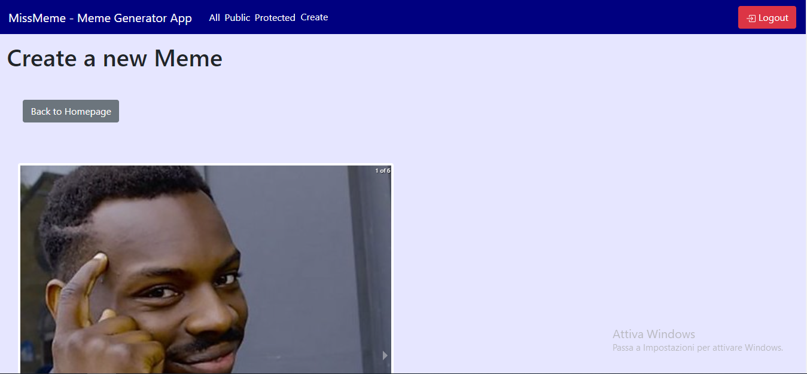
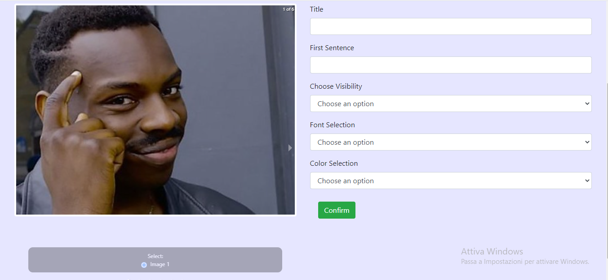
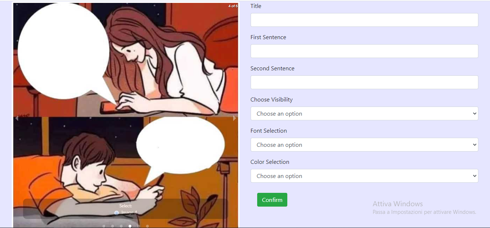

# Exam #2: "Meme Generator"
## Student: s266782 Orefice Ivana 

## React Client Application Routes

- Route `/login`: The page contains the Login Form. Its purpose would be, as the name suggests, to let the Creator user to Login, so that it can access its memes and visualize public and protected memes.
- Route `/signup`: this page contains the Signup Form, used to register a new user as Creator.
- Route `/`- `/all`: Main page, shows all the available memes, both public and protected. This page, though, is available only for creators, whereas visitors can only see public memes.
- Route `/view`: opens a modal window to better visualize the selected meme, alongside the creator meme
- Route `/copy`: opens a modal window, thanks to which the creator user can copy the selected meme
- Route `/create`: route that allows the creation of a new meme, by choosing the background image and all the attributes of the meme (title, sentences above the image, font, color and visibility).
- Route `/public`: visualize only public memes.
- Route `/protected`: visualize only protected memes.

## API Server

- POST `/api/login`: performs the Login Operation
  - Request body:
```
[ {email} ]
```
  - Response body:
  ```
[ {id, name} ]
```

- POST `/api/signup`: performs the Signup Operation
  - Request body:
```
[ {email, name, password} ]
```
  - Response body:
  ```
[ {id} ]
```

- GET `/api/memes`: Retrieves the list of all memes
  - Request body: empty
  - Response body:
```
[ {id, title, img, sentence1, sentence2, sentence3, visibility, creator_id}, 
{id, title, img, sentence1, sentence2, sentence3, visibility, creator_id} ]
```

- GET `/api/filteredMemes/:filter`: Retrieves the list of memes that satisfy the 'filter'
  - Request body: empty
  - Response body:
```
[ {id, title, img, sentence1, sentence2, sentence3, visibility, creator_id}, 
{id, title, img, sentence1, sentence2, sentence3, visibility, creator_id} ]
```
- POST `/api/memes`: Create a new meme
  - Request body: 
```
 [ {title, img, sentence1, sentence2, sentence3, visibility, font, colour, creator_id} ]
```
  - Response body: empty

- DELETE `/api/deleteMeme/:id`: delete a meme given its ID
  - Request Body:
```
 [ {id} ]
```
  - Response Body: "Meme correctly deleted"

  - POST `/api/copyMemes`: Copy an existing meme into a new one
  - Request body: 
```
 [ {title, img, sentence1, sentence2, sentence3, visibility, font, colour, creator_id} ]
```
  - Response body: empty

## Database Tables

- Table `meme` - contains following fields:
  1. ID (Primary Key, INTEGER, NOT NULL)
  2. Title (TEXT, NOT NULL)
  3. Img (TEXT)
  4. Sentence1 (TEXT)
  5. Sentence2 (TEXT)
  6. Sentence3 (TEXT)
  7. Visibility (TEXT, NOT NULL)
  8. Font (TEXT)
  9. Color (TEXT)
  10. Creator ID (INTEGER, NOT NULL)

- Table `users` - contains following fields:
  1. ID (Primary Key, INTEGER, NOT NULL)
  2. Email Address (TEXT, NOT NULL)
  3. Password Hash (TEXT, NOT NULL)
  4. Name (TEXT)

- Table `meme_img` - contains following fields:
  1. ID (Primary Key, INTEGER, NOT NULL)
  2. Img (TEXT, NOT NULL)
  3. sentence_class_1 (TEXT)
  4. sentence_class_2 (TEXT)
  5. sentence_class_3 (TEXT)

## Main React Components

- `UpperNavBar` (in `UpperNavBar.js`): this is the navbar of the application. Inside of it, you can see the name I gave to the Application, filters called 'All', 'Public' and 'Protected' (managed through the NavListElements component from NavList.js), used to filter the memes to visualize, the Create Meme Functionality and, lastly, the Login/Logout button (component Log from LogButtons.js), required to make a visitor user a creator.

- `MemeContainer` (in `MainSection.js`): Purpose of the component is to map the list of available memes inside MemeCard component, passing all the parameters needed to render each card properly.

- `CreateNewMeme` (in `CreateNewMeme.js`): the purpose of this component is to let the creator see the images available to be used as background for the meme. After the choice has been done, and so the Radio Button has been checked, the field to be filled appear in the right side of the window. The fields include title, one, two or three sentences, depending on the chosen Image, font, color and visibility.

- `MemeCard` (in `MemeCard.js`): Purpose of this component is to render the card that contains the generic information about the meme, like: 
  1. Image of the Meme
  2. Title of the Meme
  3. Creator of the Meme
  4. Buttons: View, Copy (each of those functionalities are handled through Modal Windows), Delete

- `ModalWindowView` (in `ModalWindowView.js`): the purpose of this Modal Window is to display in a very complete way the Meme: indeed we can see the actual meme (image + text over the image), with its backgroun image, the title and all the sentences, font, color and  visibility status, alongside the creator name.

- `ModalWindowCopy` (in `ModalWindowCopy.js`): the purpose of this Modal Window is to copy the selected meme. The content of this modal is variable, depending on two factors:
  1. The selected meme has been created by the user who is currently logged in: in this case, the user can modify each attribute, visibility included.
  2. The selected meme has been created by a user who is not the currently logged one: in this case, IF THE MEME IS PUBLIC, then the logged user can modify each attribute; otherwise, IF THE MEME IS PROTECTED, the visibility status can't be changed.

- `Login` (in `Login.js`): this components handles the Login procedure, by means of a dedicated form.

- `Signup` (in `Signup.js`): this components handles the Signup procedure, by means of a dedicated form.

(only _main_ components, minor ones may be skipped)

## Screenshots







## Users Credentials

- USER 1 
  1. Username: ivana@polito.it
  2. Password: IvanaPwd
  3. Name: Ivana
- USER 2
  1. Username: janedoe@polito.it
  2. Password: testPwd
  3. Name: Jane
- USER 3
  1. Username: john.doe@polito.it
  2. Password: johnPwd
  3. Name: John
- USER 4
  1. Username: robertomancini@polito.it
  2. Password: winners
  3. Name: Roberto